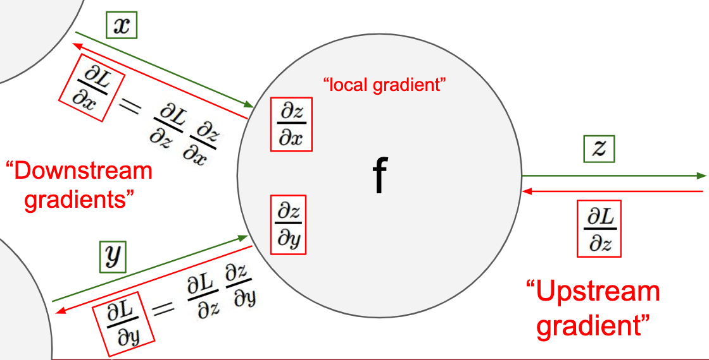

# Convolutional Neural Networks for Visual Recognition (Spring 2019)

[Formula lossless full version](https://htmlpreview.github.io/?https://github.com/liuyuqingNKCS/cs231n/blob/master/assets/README.html)

### Lecture 1 | Introduction to CNN for Visual Recognition

---

### Lecture 2 | Image Classification

- k-Nearest Neighbor

  > on images never used

  - L1 (Manhattan) distance: $d_1(I_1,I_2)=\sum_p{|I_1^p-I_2^p|}$
  - L2 (Euclidean) distance: $d_1(I_1,I_2)=\sqrt{\sum_p{(I_1^p-I_2^p)^2}}$

- Setting Hyperparameters
  1. Split data into train, validation, and test (only used once)
  2. Cross-Validation: Split data into folds
- Linear Classification
  - $s=f(x,W) = Wx + b$

---

### Lecture 3 | Loss Functions and Optimization

- Multiclass SVM
  - $L_i=\sum_{j\not =y_i}\max(0,f(x_i;W)_j-f(x_i;W)_{y_i}+1)$
  - Loss Function:
    $$L=\frac{1}{N}\sum_{i=1}^NL_i=\frac{1}{N}\sum_{j\not =y_i}\max(0,f(x_i;W)_j-f(x_i;W)_{y_i}+1)$$
- Regularization
  - $$L(W)=\frac{1}{N}\sum_{i=1}^NL_i(f(x_i,W),y_i)+\lambda{R(W)}$$
  - L2 regularization: $R(W)=\sum_k\sum_lW_{k,l}^2$
  - L1 regularization: $R(W)=\sum_k\sum_l|W_{k,l}|$
  - Elastic net (L1 + L2): $R(W)=\sum_k\sum_l\beta{W_{k,l}^2}+|W_{k,l}|$
  - Dropout, Batch normalization, Stochastic depth, fractional pooling, etc
- Softmax Classifier (Multinomial Logistic Regression)
  - Softmax Function: $P(Y=k|X=x_i)=\frac{e^{s_k}}{\sum_j{e^{s_j}}}$
  - $L_i=-log(\frac{e^{s_k}}{\sum_j{e^{s_j}}})$
  - Loss Function:
    $$L=\frac{1}{N}\sum_{i=1}^NL_i=-\frac{1}{N}log(\frac{e^{s_k}}{\sum_j{e^{s_j}}})$$
- Stochastic Gradient Descent (SGD) is:
  - On-line Gradient Descent
  - Minibatch Gradient Descent (MGD)
  - Batch gradient descent (BGD)
- Image Features

### Lecture 4 | Introduction to Neural Networks

- Gradient
  - Numerical gradient: slow :(, approximate :(, easy to write :)
  - Analytic gradient: fast :), exact :), error-prone :(
- Computational graphs
  - Patterns in Gradient Flow
    
- How to compute gradients?
  - Computational graphs + Backpropagation
    - backprop with scalars
    - vector-valued functions

### Lecture 5 | Convolutional Neural Networks

- Fully Connected Layer
- Convolution Layer
  <!-- sdas sasdsd -->
  <!-- sdas sasdsd -->
  - Accepts a volumne of size $W H D$
  - Hyperpararmeters
    - $K:\ number\ of\ filters$
    - $F:\ spatial\ extent\ of\ filter$
    - $S:\ stride$
    - $P:\ zero\ padding$
  - Produces a volume of size
    - $W=(W-F+2P)/S+1$
    - $H=(H-F+2P)/S+1$
    - $D=K$
  - The number of parameters: $(F·F·D)·K+K$
  - Pooling:
    - $W=(W-F)/S+1$
    - $H=(H-F)/S+1$
    - $D=D$

### Lecture 6 | Training Neural Networks I

> Mini-batch SGD Loop:
>
> 1. **Sample** a batch of data
> 2. **Forward** prop it through the graph (network), get loss
> 3. **Backprop** to calculate the gradients
> 4. **Update** the parameters using the gradient

#### Activation Functions (Use ReLU)

- Sigmoid problems
  1. Saturated neurons “kill” the gradients
  2. Sigmoid outputs are not zero-centered
  3. exp() is a bit compute expensive
- tanh problems
  1. still kills gradients when saturated
- ReLU problems
  1. Not zero-centered output
- Leaky ReLU
  1. Does not saturate-
  2. Computationally efficient-
  3. Converges much faster than sigmoid/tanh in practice! (e.g. 6x)-
  4. will not “die”
- Parametric Rectifier (PReLU)
- Exponential Linear Units (ELU)
  - All benefits of ReLU-Closer to zero mean outputs
  - Negative saturation regime compared with Leaky ReLU adds some robustness to noise
- Maxout “Neuron”

> Use ReLU. Be careful with your learning rates
> Try out Leaky ReLU / Maxout / ELU
> Try out tanh but don’t expect much
> Don’t use sigmoid

#### Data Preprocessing (Images: subtract mean)

- **zero-centered** (image only this)
- **normalized data**
- PCA
- Whitening

#### Weight Initialization (Use Xavier/He init/MSRA)

- tanh + “Xavier” Initialization: std = 1/sqrt(Din)
- ReLU + He et al. Initialization: std = sqrt(Din / 2)
- ReLU + Kaiming / MSRA Initialization: std = sqrt(2 / Din)

#### Batch Normalization (Use)

#### Babysitting the Learning Process

1. Double checkout the loss is reasonable
2. learning rate: 1e-5 ~ 1e-3

#### Hyperparameter Optimization

1. Only run a few epochs first
2. If the cost is ever > 3 \* original cost, breat out
3. Random Search Hyperparameter > Grid Search Hyperparameter

### Lecture 7 | Training Neural Networks II

#### Fancier optimization

> - **Adam** is a good default choice in many cases; it often works ok even with constant learning rate
> - **SGD + Momentum** can outperform Adam but may require more tuning of LR and schedule
>   - Try cosine schedule, very few hyperparameters!
> - If you can afford to do full batch updates then try out **L-BFGS** (and don’t forget to disable all sources of noise)

- Problems with SGD (梯度方向？)

  1. Loss function has high condition number

     - ratio of largest to smallest singular value of the Hessian matrix is large

  2. Local minima / Saddle points
  3. Our gradients come from minibatches so they can be noisy

  > SGD: $x_{t+1}=x_t-\alpha{\triangledown f(x_t)}$
  > SGD + Momentum: $x_{t+1}=x_t-\alpha{(\rho{v_t}+\triangledown f(x_t))}$
  > SGD + Nesterov Momentum: $x_{t+1}=x_t+\rho{v_t}-\alpha{\triangledown f(x_t+\rho{v_t})}$

- AdaGrad => RMSProp (Leaky AdaGrad) (梯度大小)
  
- Adam (almost)
  
- Learning Rate Decay (common with momentum & less common with Adam)
  </img>
- Second-Order Optimization (without learning rate)
  - First-Order Optimization
    1. Use gradient form linear approximation
    2. Step to minimize the approximation
  1. Use gradient and Hessian to form quadratic approximation
  2. Step to the minima of the approximation
     </img>
- Model Ensembles: Tips and Tricks

#### Regularization

- Add term to loss
- Dropout: In each forward pass, randomly set some neurons to zero
  - Probability of dropping is a hyperparameter; 0.5 is common
- Batch Normalization
- Data Augmentation
  - Horizontal Flips
  - Random crops and scales
  - Color Jitter
    - Simple: Randomize contrast and brightness
    - Complex: Apply PCA to all [R, G, B]
  - Random mix/combinations of:
    - translation, rotation, stretching, shearing, lens distortions
- DropConnect (set weights to 0)
- Fractional Max Pooling
- Stochastic Depth
- Cutout
- Mixup

#### Tansfer learning

|                         | very similar dataset               | very different dataset                                         |
| ----------------------- | ---------------------------------- | -------------------------------------------------------------- |
| **very little data**    | Use Linear Classifier on top layer | You’re in trouble… Try linear classifier from different stages |
| **quite a lot of data** | Finetune a few layers              | Finetune a larger number of layers                             |

Have some dataset of interest but it has < ~1M images?

1. Find a very large dataset that has similar data, train a big ConvNet there
2. Transfer learn to your dataset

Deep learning frameworks provide a “Model Zoo” of pretrained models so you don’t need to train your own
Caffe: https://github.com/BVLC/caffe/wiki/Model-Zoo
TensorFlow: https://github.com/tensorflow/models
PyTorch: https://github.com/pytorch/vision

#### Choosing Hyperparameters

1. Check initial loss
2. Overfit a small sample
3. Find LR that makes loss go down
4. Coarse grid, train for ~1-5 epochs
5. Refine grid, train longer
6. Look at loss curves
